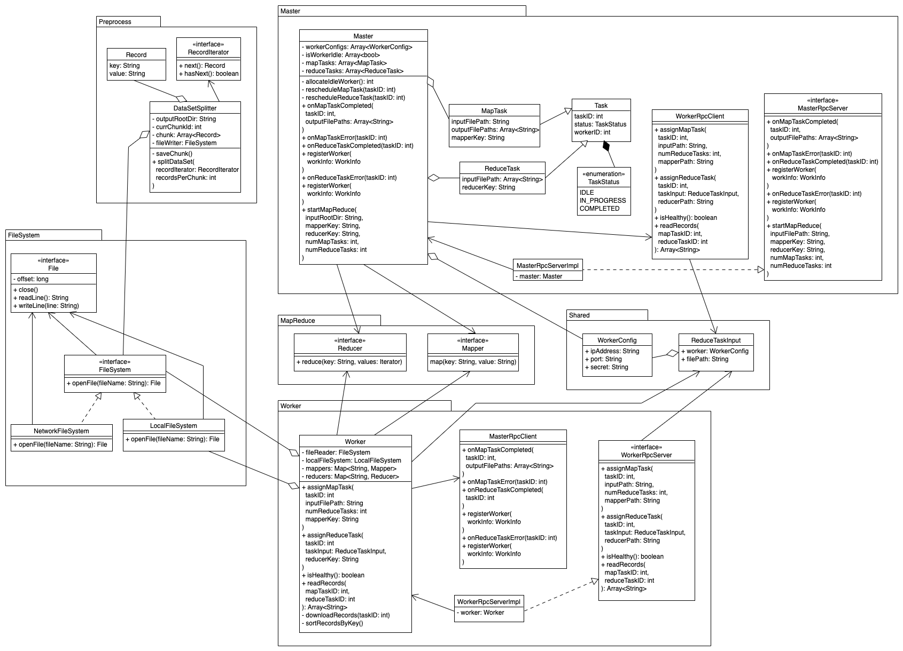

# GapReduce

Distributed cluster designed for processing terabytes of data in parallel.

## Background

In 2004, Google published [a paper](https://pdos.csail.mit.edu/6.824/papers/mapreduce.pdf) introducing its cutting edge distributed parallel big data computing architecture: MapReduce.

In 2006, Doug Cutting started a in house Java implementation of MapReduce called Hadoop at Yahoo.

In 2008, Yahoo released the first version of Hadoop for public usage, which significantly shaped modern distributed computing tecnologies.

In 2019, [Harry](https://short-d.com/r/ghharry), an open source evangelist, decided to create a Go implementation of MapReduce with the most cutting edge technologies stack and optimized performance in order to provide an alternative to Hadoop for Go developers and enterprise users.

## Architecture

## Author

Harry Liu - *Initial work* - [byliuyang](https://short-d.com/r/ghharry)

## License

This project is maintained under MIT license

